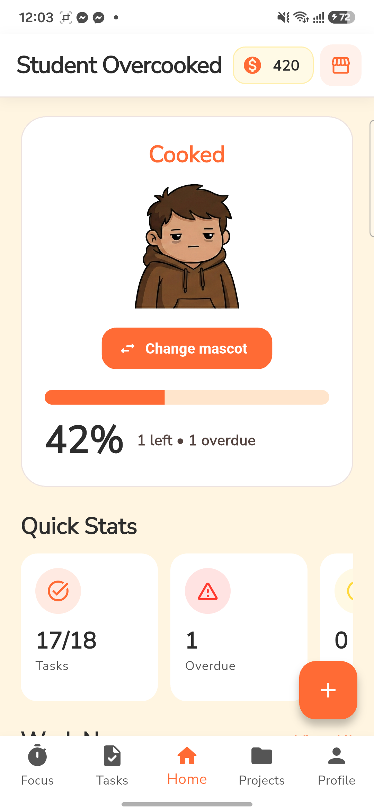
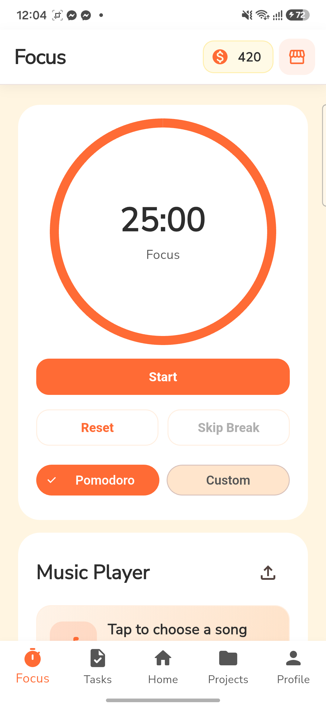
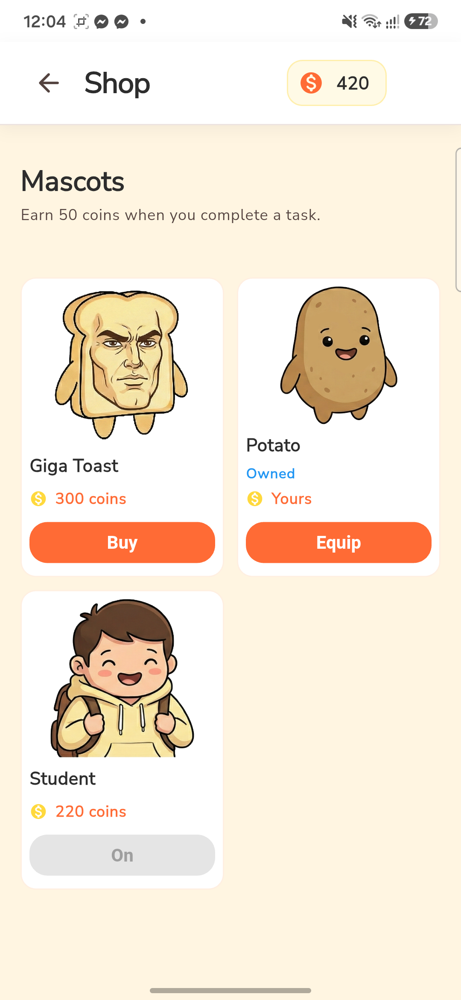
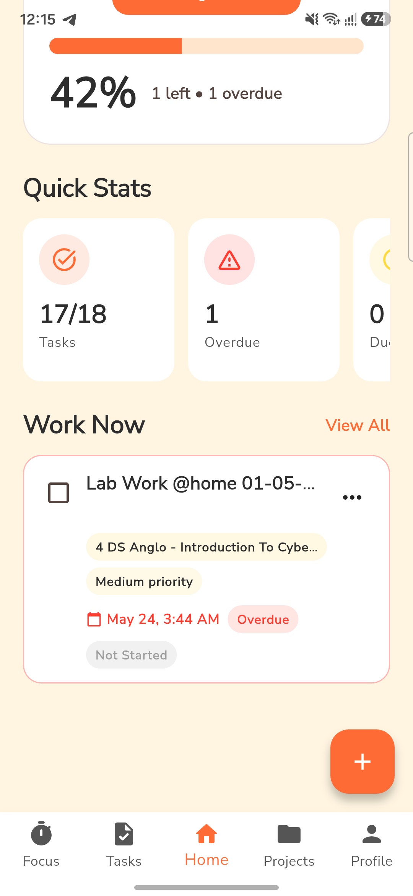
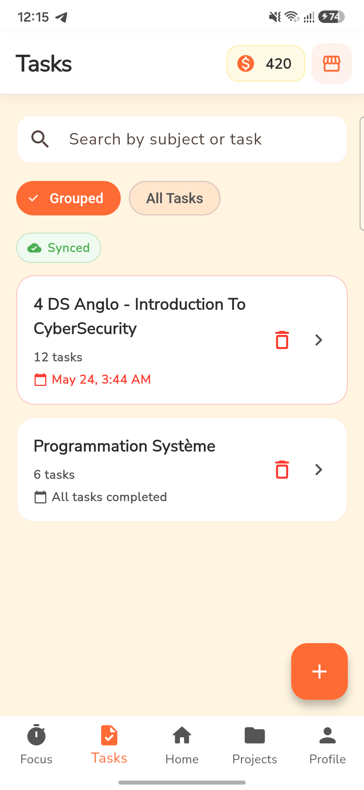
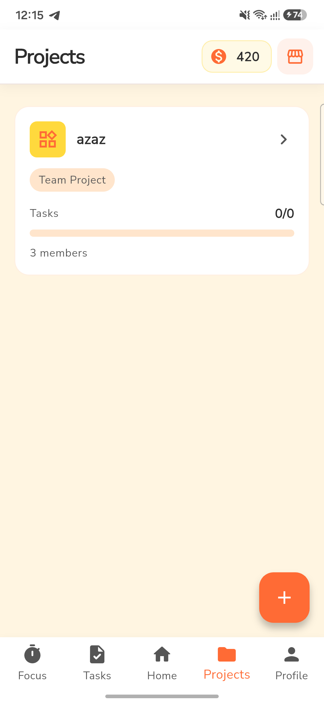
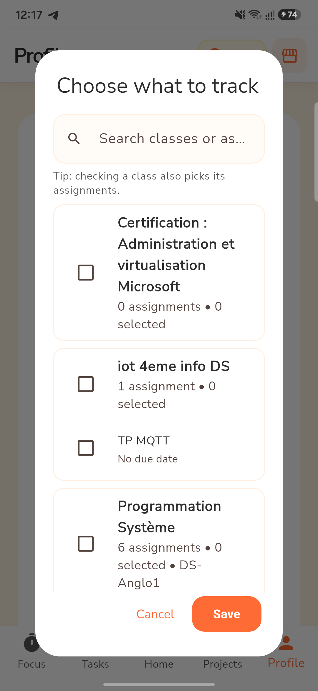
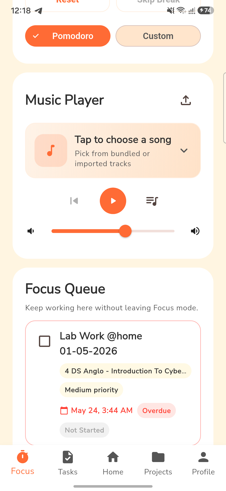

<p align="center">
  
</p>

<h1 align="center">Student Overcooked</h1>

<p align="center">
  <strong>Your semester is on fire. At least now it has a timer.</strong>
</p>

<p align="center">
  
  
  
  
</p>

> Hi. I am an overcooked student. I have a report due tonight, three assignments hiding in Google Classroom, a group project whose chat has become archaeological evidence, and exactly 25 minutes of focus left in me.
>
> So I built a kitchen for the chaos: one place to collect the work, decide what matters, start a timer, and slowly become less crispy.

Student Overcooked is a playful Flutter productivity app for students managing classes, assignments, team projects, and study sessions. It combines serious planning tools with a mascot that reflects how cooked your workload currently feels.

## 📱 Try the Android preview

[**Download Student Overcooked for Android (ARM64 APK)**](releases/student-overcooked-android-arm64-v1.0.0.apk)

This preview APK is built for modern 64-bit Android phones. It is a release-mode build signed with the development key, so Android may ask you to allow installation from your browser or file manager. It is not a Play Store production release.

`SHA-256: C6AEAD2A6FF7DB6A87E66BD7AFFD8E18F79CAE6BC375DE0A67A8BF1FB7166EF0`

Need another Android architecture? Build the matching APK locally:

```bash
flutter build apk --release --split-per-abi
```

The generated APKs appear in `build/app/outputs/flutter-apk/`.

## 🔥 A quick look

<table>
  <tr>
    <td width="33%" align="center"></td>
    <td width="33%" align="center"></td>
    <td width="33%" align="center"></td>
  </tr>
  <tr>
    <td align="center"><strong>Know how cooked you are</strong></td>
    <td align="center"><strong>Protect one focused block</strong></td>
    <td align="center"><strong>Spend progress on personality</strong></td>
  </tr>
  <tr>
    <td width="33%" align="center"></td>
    <td width="33%" align="center"></td>
    <td width="33%" align="center"></td>
  </tr>
  <tr>
    <td align="center"><strong>See what needs doing now</strong></td>
    <td align="center"><strong>Keep every task in order</strong></td>
    <td align="center"><strong>Move projects forward together</strong></td>
  </tr>
  <tr>
    <td></td>
    <td align="center"></td>
    <td></td>
  </tr>
  <tr>
    <td></td>
    <td align="center"><strong>Import only the Classroom work you want</strong></td>
    <td></td>
  </tr>
</table>

Screenshots were captured from the real Android app on a Galaxy S23 running Android 16.

## Send a task into Focus

When one assignment deserves the whole burner:

1. Open **Tasks** and switch to **All Tasks**.
2. Tap the task's three-dot menu.
3. Choose **Send to Focus**.
4. Open **Focus** and scroll to the **Focus Queue**. The task stays actionable without leaving the timer.

<p align="center">
  <a href="docs/demo/full-demo.mp4">
    
  </a>
</p>

<p align="center">
  <strong><a href="docs/demo/full-demo.mp4">Watch the 52-second full app demo</a></strong><br />
  Tap the screenshot for the complete MP4 walkthrough.
</p>

## What is in the kitchen?

- **Tasks and subjects:** create, edit, search, group, prioritize, and safely complete assignments with confirmation before marking work done.
- **Google Classroom:** connect your account, import classes and assignments, retry interrupted syncs, and clearly see connection state.
- **Focus mode:** run a working 25-minute Pomodoro or a custom session, switch into breaks, and receive completion notifications.
- **Music while studying:** choose bundled audio or import a track from your device.
- **Projects:** organize individual and group work, assign tasks, claim work, chat with teammates, and use the project assistant.
- **Cooked Meter:** turn live task pressure into one short, readable heat level instead of another paragraph to process.
- **Coins and mascots:** earn coins by completing work, visit the shop, unlock mascots, and equip your favorite study companion.
- **Account safety:** email and Google authentication, verification states, persistent sessions, and complete sign-out from both the app and Classroom.
- **Light and dark themes:** warm cream for daytime planning and a low-light theme for the 2 AM academic decisions we do not discuss.

## Meet the study crew

<p align="center">
  
  &nbsp;&nbsp;&nbsp;
  
  &nbsp;&nbsp;&nbsp;
  
</p>

The launcher icon is generated from [`assets/mascots/student/cooked.png`](assets/mascots/student/cooked.png) without stretching. The square source used by each platform lives at [`assets/icon/student_cooked_icon.png`](assets/icon/student_cooked_icon.png), and the reproducible generator is in [`tool/generate_app_icon.dart`](tool/generate_app_icon.dart).

Regenerate every platform icon with:

```bash
dart run tool/generate_app_icon.dart
dart run flutter_launcher_icons
```

## 🧑‍🍳 Run it locally

### Prerequisites

- Flutter `3.41.x` or a compatible stable release
- Dart `3.11.x` or newer within the project SDK constraint
- Android Studio and an Android SDK for Android builds
- Xcode for iOS or macOS builds
- A Firebase project for authentication and cloud data

### Start the app

```bash
git clone https://github.com/aziz-sridi/student-overcooked-flutter.git
cd student-overcooked-flutter
flutter pub get
flutter devices
flutter run -d <device-id>
```

Useful targets include:

```bash
flutter run -d chrome      # Web
flutter run -d windows     # Windows desktop
flutter run -d <android-device-id>
```

### Firebase setup

The repository contains the app-side Firebase wiring. For your own fork or Firebase project:

```bash
dart pub global activate flutterfire_cli
flutterfire configure
```

Then enable the authentication providers you want in Firebase Authentication and configure Firestore access for your environment.

Google Classroom also requires OAuth consent, the Classroom API scopes, platform client IDs, and approved test users in your Google Cloud project.

## 🧪 Check your mise en place

```bash
flutter analyze
flutter test
flutter build apk --debug
flutter build web
```

The widget tests currently cover narrow-screen task cards, accidental-completion confirmation, and the shared top bar title layout.

## Project map

```text
lib/
├── core/theme/          # Colors and app-wide theme
├── data/                # Firebase, Classroom, tasks, projects, focus, notifications
├── features/            # Auth, Home, Tasks, Focus, Projects, Shop, Profile
├── models/              # App data models
└── widgets/             # Shared cards and controls

assets/
├── icon/                # Square launcher icon sources
├── mascots/             # Mascot stages and shop artwork
└── songs/               # Bundled focus audio

backend/                 # Optional Python backend services
docs/demo/               # Short real-device walkthroughs
docs/screenshots/        # Real Android screenshots used in this README
releases/                # Downloadable preview APK
tool/                    # Reproducible project utilities
```

## Notes before serving the whole campus

- The included APK is a development preview, not a production-signed store artifact.
- Google Classroom OAuth scopes may require Google verification before public distribution.
- Native Google sign-in is not currently available on Windows or Linux.
- Notifications require permission from the operating system.

## Contributing

Bug fixes, calmer empty states, new mascot ideas, and improvements that help students reach the next useful action are welcome.

1. Create a branch.
2. Make the smallest coherent change.
3. Run `flutter analyze` and `flutter test`.
4. Open a pull request with screenshots for visible UI changes.

<p align="center">
  <strong>Plan the work. Start the timer. Avoid becoming charcoal.</strong>
</p>
